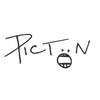

## Nick Rupp

[Projects](#projects) | [Education](#education) | [Experience](#experience) | [Blog](https://medium.com/@nickrupp95) | [LinkedIn](https://www.linkedin.com/in/nick-rupp-16663912a/)

Enthusiastic Mechanical Engineering student with a strong academic track record excelling in Design and Coding modules. Regional finalist in the contribution to business awards 2014 for work at Delphi Diesel Systems. Looking to use coding and engineering skills to tackle computer development problems from a grounded technical background.

## Projects
#### Coding Projects
|Logo|Project|Description|Technologies|
|---|---|---|---|
||[Loops and Cats](https://github.com/whatsrupp/loops-and-cats)|An app which allows you to create music through the infinite looping of your live audio recordings |Node.js, Javascript, Web Audio API, Jasmine, Wavesurfer.js|
||[Train Spotter](https://github.com/whatsrupp/train-spotter)|Javascript App to find out what train you're on and alert commuters of delays|Node.js, Heroku, Mocha, Zombie, Bootstrap|
||[Pictoon](https://github.com/whatsrupp/toon)|Clone of Instagram, using ruby on rails and amazon web server hosting |Rails, RSPEC, Postgresql, AWS server hosting|
||[Noughty News](https://github.com/whatsrupp/noughty-news)|Single page Javascript app to collate tech news from the Guardian API|Written and Tested only using Vanilla Jasvascript|
||[Iris Classifier](https://github.com/whatsrupp/iris-classification)|Simple machine learning app to classify iris leaves|Python|

#### Engineering Projects
| Project   | Description |
|---        |---         |
|[Projectile Simulation](https://github.com/whatsrupp/matlab-projectile-model)|Programme to simulate a rocket’s flight using a variety of numerical solving concepts.|
|[Re-Entry Simulation](https://github.com/whatsrupp/matlab-shuttle-model)|Analysis programme of thermal transfer in a space shuttle tile under various situations.|
|Drone Racing|Design proposal of creative expansion options for the fast-emerging e-sport.|
|Jeans Folding Machine|Generation of detailed manufacturing process to process jeans before shipment.|
|Ping Pong Ball Launcher|Design and build a functioning ping-pong ball launcher to meet challenge requirements.|
|Dragster|Design and build a spring-powered racing dragster to race against other student groups.|
|Gearbox Design|Designed and hand drew the technical drawings of a clash gearbox for a boat.|
|Washing Machine|Proposed the solution of a pedal powered washing unit for third world application.|

#### Extra Projects
###### Video Editing and Production
I find video production engaging due to the balance between creative and technical thought. I have spent an extensive amount of time writing, filming and editing videos on both a commercial freelance basis or for personal interest. I have attended a week long film production course and I am involved with Bath University’s media society, filming promotional material.
###### A Cappella Marketing
I am heavily involved with a nationally competitive a cappella group, Aquapella, placing 2nd /3rd in two national competitions (VFUK, ICCA). I was responsible for the branding and marketing of our two Edinburgh Fringe Recommended Show. This included the design of the poster, the design of the merchandise and liaising with the venue.

## Education

#### Makers Academy (March - June 2017)

The marketing team at Makers pitch it as 'Learning to code in 12 weeks' and I definitely learnt Javascript and Ruby to a good standard. However, having gone through the process, I think the main value I took from a bootcamp like Makers were the values and culture I picked up from it.
It taught me how to be a pro-active and independent learner in order to deal with problems that initially seem unsolvable. It taught me how to collaborate and work in a group environment. Finally, it taught me how to be excited about work.

As a summary, over the 3 months I was exposed to:

|  Area  | Technologies |
|---        |---         |
|Production Languages| Ruby, Javascript, Node.js, Rails|
|Testing Frameworks| Rspec, Capybara, Mocha, Jasmine, Zombie|
|Approaches| Test Driven Development, Object Orientated Programming, SOLID prinicples, Extreme Programming(XP) values.|

#### University of Bath (2014 - Ongoing)
MEng (hons) Mechanical Engineering (5 Year Sandwich): Year 1 & 2 combined grade average of 70.3% (Full transcript available on request)

#### Sevenoaks School
IB Diploma (2013): 43/45 Total with full marks in Higher level subjects of Maths, Physics and Design 2010-2012
IGCSEs (2011) : 11 Subjects 9A*, 1A, 1B

## Experience

**Premier Model Management** (Sept 2014 - Present)
Two years of involvement with the fashion industry has been a great opportunity to earn money whilst pursuing my university interests and given a full insight into the commercial advertising process. The improvement of time-management skills, ability to deal with rejection and increased confidence with meeting new clients around Europe have been invaluable.

**Delphi Diesel Systems** (September 2013 - June 2015)
Delphi’s Stonehouse branch is a high-volume production facility for precision fuel injectors, specialising in micron level finishing. As a manufacturing systems engineer I was given control of and improved a finishing lathe, the loader that fed the lathe and an end of line electrical test machine. The streamlining and correction of the electrical test process saved Delphi £100,000+ per annum and meant I reached the Year in Industry Contribution to Business awards regional finals.

**Lotus Formula 1 Enstone** (1 week in July 2012)
I worked on a team that responsible for a hydraulic transmission dynamometer designed to run endurance testing experiments of the F1 gearboxes and clutch. I was asked to construct a model which, when given the front wheel / engine RPM and the car's gear ratios, could work out which gear was being used as well as acceleration, velocity and distance at any point.

## Hobbies and Interests
- **Music** : Cello, Drums, Singing and Piano
- **Track** : 400m and High Jump
- **Fitness** : Triathlon and Half Marathon
- **Photography** : Night time exposures, Architecture and Portraits.
